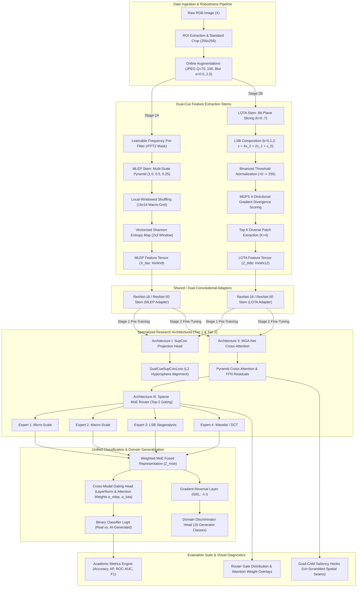

# Comprehensive Development Roadmap: Dual-Cue AI-Generated Image Detection (MLEP & LOTA Fusion)

> [!IMPORTANT]
> **Engineering Mandate**: This development roadmap synthesizes the exhaustive technical requirements from all five project specification documents in the repository without altering or redesigning the foundational architectures. It serves as the definitive engineering blueprint for **Aishwarya** (LOTA, Architecture II MGA-Net, and Evaluation/Explainability Lead on Apple Silicon M4) and **Kushagra** (MLEP, Architecture I SupCon, Architecture III MoE/DANN, and Infrastructure Lead on NVIDIA RTX 4050).

---

## 1. Complete Dependency Graph

The following Mermaid diagram illustrates the end-to-end data flow, module dependencies, and architectural synthesis of the Dual-Cue AIGID system—from raw image ingestion to final anomaly classification, domain unlearning, and visual explainability.



---

## 2. Module Hierarchy

The codebase is engineered around high-throughput, vectorized PyTorch primitives designed to eliminate slow Python loops and operate seamlessly across both CUDA and Apple Metal backend devices.

```
mlep_lota_fusion/
├── src/
│   ├── data/                          [Package: Data Ingestion & Preprocessing]
│   │   ├── transforms.py              ├── Standard ROI cropping, 15% margin facial bounds, uint8 normalization
│   │   ├── augmentations.py           ├── Online robustness transforms: JPEG recompression (Q=70..100) & Gaussian blur
│   │   ├── dataset.py                 ├── PyTorch Dataset loaders for ForenSynths (ProGAN) and GenImage (8 splits)
│   │   └── samplers.py                └── Balanced Real/Fake class samplers to prevent majority class drift
│   │
│   ├── models/                        [Package: Deep Learning Architectures & Stems]
│   │   ├── mlep.py                    ├── VectorizedMLEPExtractor: Pyramid folding, local shuffling, 2x2 unfold entropy
│   │   ├── lota.py                    ├── TopKLOTAExtractor: Bit-plane slicing, thresholding, 4-dir MGPS scoring
│   │   ├── backbones.py               ├── Modified ResNet-18/50 stems adapting 9-ch MLEP and 12-ch LOTA inputs
│   │   ├── arch1_supcon.py            ├── LearnableFrequencyPreFilter (rFFT2 mask), DualCueSupConLoss, LearnableFreqSupConNet
│   │   ├── arch2_mganet.py            ├── PyramidCrossAttentionModule, FFN bottleneck residuals, MGANetDualCueDetector
│   │   ├── arch3_moe.py               ├── ExpertModule, SparseMoEForensicModule (Top-2 routing), GRL, DomainDiscriminator
│   │   └── fusion_model.py            └── DualCueAIGIDModel: Master configurable end-to-end assembly wrapper
│   │
│   ├── utils/                         [Package: Utilities & Infrastructure]
│   │   ├── device.py                  ├── Dynamic hardware resolution (CUDA vs. Metal MPS vs. CPU) and seed management
│   │   └── benchmark_ops.py           └── Latency (ms/img), throughput (images/sec), and VRAM/UMA memory profiling
│   │
│   └── eval/                          [Package: Evaluation, Benchmarking & Explainability]
│       ├── metrics.py                 ├── Academic calculators: Accuracy, Precision, Recall, F1, ROC-AUC, AP
│       ├── evaluator.py               ├── Automated cross-generator zero-shot evaluation loop & table compiler
│       ├── explainability.py          ├── Grad-CAM backward hooks on un-scrambled spatial maps & attention overlay generator
│       ├── robustness_suite.py        ├── Automated JPEG compression (Q=70..100) and blur (σ=0.5..2.0) degradation evaluator
│       └── benchmark_throughput.py    └── GPU (FP16/BF16) vs. Apple Metal throughput scaling benchmarks
```

### Detailed Functional Responsibilities by Module

| Module / Class | Primary Technical Responsibility | Key Mathematical & Architectural Primitives |
| :--- | :--- | :--- |
| `src.data.dataset` | Ingests benchmark datasets and standardizes input dimensions to $256 \times 256 \times 3$. | Handles ForenSynths (4 ProGAN categories) and GenImage (8 generator domains). |
| `src.models.mlep` | Extracts statistical randomness without macro-semantic bias. | Vectorized tensor unfolding (`F.unfold`), 3-level resampling pyramid $\{1.0, 0.5, 0.25\}$, local $16 \times 16$ windowed shuffling, discrete entropy mapping $\mathbb{V} \in \{0, 0.8, 1.0, 1.5, 2.0\}$. |
| `src.models.lota` | Isolates zero-cost quantization noise and LSB steganalysis residuals. | 8-bit slicing, weighted LSB composition $z^c = 4x_2 + 2x_1 + x_0$, binarized thresholding $>0 \to 255$, 4-directional MGPS convolution kernels ($g_x, g_y, g_{xy}, g_{yx}$), Top-$K$ diverse patch extraction ($K=4$). |
| `src.models.arch1_supcon` | Reconciles scale disparity and strips JPEG blockiness before classification. | Learnable Butterworth rFFT2 frequency attenuation mask $H_\theta(u, v)$, Supervised Contrastive Loss ($\mathcal{L}_{\text{SupCon}}$) over L2 normalized hypersphere embeddings ($\tau=0.07$). |
| `src.models.arch2_mganet` | Solves spatial and scale misalignment between entropy and quantization. | Spatio-modal Query-Key affinity matrix $\mathcal{A} = \text{Softmax}(\mathbf{Q}^T \mathbf{K} / \sqrt{d})$, $1 \times 1$ projections, GroupNorm, FFN residual bottleneck refinement. |
| `src.models.arch3_moe` | Eliminates generator identity overfitting to achieve zero-shot transfer. | 4 domain-specific residual experts, Top-2 noisy gating router with load-balancing auxiliary loss ($\mathcal{L}_{\text{aux}}$), Gradient Reversal Layer ($\mathcal{R}(z)$, $-\lambda \mathbf{I}$), 16-class Domain Discriminator. |
| `src.models.fusion_model` | Master unified architecture wrapper and dynamic cross-modal gating. | Reconciles $[0, 1.0]$ continuous entropy with $[0, 255]$ thresholded bit-planes via LayerNorm; dynamically predicts attention gating weights $\alpha_{\text{MLEP}} + \alpha_{\text{LOTA}} = 1.0$. |
| `src.eval.explainability` | Provides visual explainability and anomaly localization for presentation defense. | Backpropagates classifier gradients to un-scrambled spatial feature branch $\mathbf{H}_{\text{cross}}$ to render pixel-accurate Grad-CAM forgery heatmaps. |

---

## 3. Folder Structure

The project structure guarantees clean separation of concerns, zero file-collision during collaboration, and cross-platform compatibility.

```text
DL_AND_CV_PROJECT/
├── .github/
│   └── workflows/
│       └── ci.yml                          # Continuous integration matrix (Linux/macOS, PyTorch 2.x)
├── configs/
│   ├── default.yaml                        # [Joint] Master model and training default hyperparameters
│   ├── train_baseline_progan.yaml          # [Joint] Stage 1 pre-training config on ForenSynths (ProGAN)
│   ├── train_fusion_genimage.yaml          # [Joint] Stage 2 fine-tuning config on GenImage (SD v1.5 vs ImageNet)
│   └── eval_zeroshot_2026.yaml             # [Joint] Config for 2026 diffusion stress benchmark (FLUX.1, SD3)
├── docs/
│   ├── mlep_pipeline.md                    # [Kushagra] Mathematical specification for MLEP entropy folding
│   ├── lota_pipeline.md                    # [Aishwarya] Technical specification for LOTA LSB slicing and MGPS
│   └── architectures.md                    # [Joint] Detailed specs for Arch I (SupCon), II (MGA-Net), and III (MoE)
├── scripts/
│   ├── train_arch1.py                      # [Kushagra] Standalone training script for Learnable Freq & SupCon
│   ├── train_arch2.py                      # [Aishwarya] Standalone training script for MGA-Net Cross-Attention
│   ├── train_end_to_end.py                 # [Joint] Master end-to-end 2-stage training loop
│   ├── evaluate_zeroshot.py                # [Aishwarya] Cross-generator zero-shot evaluation CLI
│   ├── visualize_mlep.py                   # [Kushagra] Spatial entropy heatmap diagnostic visualizer
│   ├── visualize_lota.py                   # [Aishwarya] Bit-plane decomposition & gradient divergence visualizer
│   └── generate_figures.py                 # [Aishwarya] Automated publication graph & ROC curve exporter
├── src/
│   ├── __init__.py
│   ├── data/
│   │   ├── __init__.py
│   │   ├── transforms.py                   # [Kushagra] Standardized cropping, resizing, and normalization
│   │   ├── augmentations.py                # [Kushagra] Online robustness transforms (JPEG, Gaussian blur)
│   │   ├── dataset.py                      # [Kushagra] ForenSynths & GenImage dataset loaders
│   │   └── samplers.py                     # [Kushagra] Balanced class samplers
│   ├── models/
│   │   ├── __init__.py
│   │   ├── mlep.py                         # [Kushagra] VectorizedMLEPExtractor & multi-scale pyramid
│   │   ├── lota.py                         # [Aishwarya] TopKLOTAExtractor, bit-planes & MGPS filter
│   │   ├── backbones.py                    # [Kushagra] ResNet-18/50 stems & channel adapters
│   │   ├── arch1_supcon.py                 # [Kushagra] LearnableFrequencyPreFilter & LearnableFreqSupConNet
│   │   ├── arch2_mganet.py                 # [Aishwarya] PyramidCrossAttentionModule & MGANetDualCueDetector
│   │   ├── arch3_moe.py                    # [Kushagra] SparseMoEForensicModule, GRL & DomainAdversarialMoEDetector
│   │   └── fusion_model.py                 # [Joint] DualCueAIGIDModel master end-to-end assembly
│   ├── utils/
│   │   ├── __init__.py
│   │   ├── device.py                       # [Joint] Dynamic backend selector (CUDA/MPS/CPU) & seed setter
│   │   └── benchmark_ops.py                # [Joint] Latency, throughput, and hardware profiling utilities
│   └── eval/
│       ├── __init__.py
│       ├── metrics.py                      # [Aishwarya] Accuracy, AP, ROC-AUC, F1, and confusion matrices
│       ├── evaluator.py                    # [Aishwarya] Quantitative evaluation loop & markdown table compiler
│       ├── explainability.py               # [Aishwarya] Grad-CAM hooks and spatial saliency overlay generator
│       ├── robustness_suite.py             # [Aishwarya] Automated compression and blurring stress-test suite
│       └── benchmark_throughput.py         # [Aishwarya] GPU (FP16/BF16) and Metal throughput scaling suite
├── tests/
│   ├── test_mlep.py                        # [Kushagra] Unit tests for vectorized entropy and shuffling bounds
│   ├── test_lota.py                        # [Aishwarya] Unit tests for bit-plane extraction and MGPS ranking
│   ├── test_arch1.py                       # [Kushagra] Unit tests for FFT filter backprop and SupCon symmetry
│   ├── test_arch2.py                       # [Aishwarya] Unit tests for cross-attention matrix normalization
│   ├── test_arch3.py                       # [Kushagra] Unit tests for Top-2 routing sparsity and GRL reversal
│   └── test_eval.py                        # [Aishwarya] Unit tests for metric calculator exactness
├── .flake8                                 # Linter configuration (line length 100, ignore E203, W503)
├── .gitignore                              # Excludes checkpoints, raw datasets, __pycache__, .DS_Store
├── pyproject.toml                          # Modern Python project configuration & tool specifications
├── README.md                               # Master academic README with setup, execution, and benchmark tables
└── requirements.txt                        # Cross-platform dependencies (torch, torchvision, numpy, matplotlib, etc.)
```

---

## 4. File Creation Order

To maximize engineering velocity across the 3-week sprint timeline, files must be implemented in chronological order. This sequence ensures that peer dependencies are always established before dependent modules begin coding.

```
[Phase 1: Week 1 (28 Jul - 3 Aug)] ──► [Phase 2: Week 2 (4 Aug - 10 Aug)] ──► [Phase 3: Week 3 (11 Aug - 18 Aug)]
Baselines & Preprocessing Primitives     Specialized Architectures I & II       Arch III, Eval Suite & Integration
```

### Phase 1: Foundation, Data Ingestion & Preprocessing Primitives (Week 1)
*Goal: Establish repository standards and verify standalone MLEP and LOTA feature extractors.*

1. **`pyproject.toml`, `requirements.txt`, `.gitignore`, `README.md`** *(Joint Lead)*
   * Define cross-platform dependencies (`torch>=2.0.0`, `torchvision`, `numpy`, `matplotlib`, `seaborn`, `pytest`, `black`, `flake8`).
2. **`src/utils/device.py`** *(Joint Lead)*
   * Implement `get_compute_device()` and global seed initialization across CUDA, MPS, and CPU backends.
3. **`configs/default.yaml`, `configs/train_baseline_progan.yaml`** *(Joint Lead)*
   * Establish baseline hyperparameters ($256 \times 256$ input resolution, $L=2$ patch size, batch size 32/64).
4. **`src/data/transforms.py`, `src/data/dataset.py`, `src/data/samplers.py`** *(Kushagra)*
   * Build dataset loaders for ForenSynths (ProGAN) and GenImage with standard bounding-box ROI cropping.
5. **`src/models/mlep.py` & `tests/test_mlep.py`** *(Kushagra)*
   * Implement `VectorizedMLEPExtractor`, multi-scale pyramid resampling $\{1.0, 0.5, 0.25\}$, local $16 \times 16$ windowed shuffling, and vectorized $2 \times 2$ Shannon entropy unfolding. Verify via unit tests.
6. **`src/models/lota.py` & `tests/test_lota.py`** *(Aishwarya)*
   * Implement `TopKLOTAExtractor`, 8-bit slicing, LSB composition ($k=0,1,2$), binarized threshold normalization ($>0 \to 255$), 4-directional MGPS gradient scoring, and Top-$K$ extraction. Verify via unit tests.
7. **`scripts/visualize_mlep.py`** *(Kushagra)* & **`scripts/visualize_lota.py`** *(Aishwarya)*
   * Create CLI diagnostic scripts to export visual entropy heatmaps and LSB bit-plane anomaly grids.
8. **`docs/mlep_pipeline.md`** & **`docs/lota_pipeline.md`** *(Kushagra & Aishwarya)*
   * Document mathematical formulations and module APIs.
   * **Milestone 1 Weekend Sync (3–4 Aug)**: Peer code review and merge `feature/mlep-pipeline` and `feature/lota-pipeline` into `develop`.

### Phase 2: Specialized Deep Learning Architectures I & II (Week 2)
*Goal: Construct backbone adapters, frequency pre-filters, SupCon alignment, and MGA-Net cross-attention.*

9. **`src/models/backbones.py`** *(Kushagra)*
   * Build shared/dual ResNet-18 and ResNet-50 feature stems with modified stem channel adapters.
10. **`src/models/arch1_supcon.py` & `tests/test_arch1.py`** *(Kushagra)*
    * Implement `LearnableFrequencyPreFilter` (rFFT2 Butterworth mask), `DualCueSupConLoss`, and `LearnableFreqSupConNet`. Write unit tests verifying FFT gradient backprop and loss stability.
11. **`scripts/train_arch1.py`** *(Kushagra)*
    * Build standalone Stage 1 contrastive pre-training script with CUDA AMP (`fp16`) support.
12. **`src/models/arch2_mganet.py` & `tests/test_arch2.py`** *(Aishwarya)*
    * Implement `PyramidCrossAttentionModule`, FFN bottleneck residuals, and `MGANetDualCueDetector`. Write unit tests verifying attention affinity matrix normalization ($\sum \mathcal{A} = 1.0$).
13. **`scripts/train_arch2.py`** *(Aishwarya)*
    * Build standalone MGA-Net training script optimized for Apple Metal MPS execution.
14. **`docs/architectures.md`** *(Joint Lead)*
    * Document architectural specifications and tensor dimensions.
    * **Milestone 2 Weekend Sync (10–11 Aug)**: Merge `feature/arch1-supcon` and `feature/arch2-mganet` into `develop`; verify joint forward/backward gradient flows.

### Phase 3: Architecture III, Evaluation Suite & Explainability (Week 3: 11–15 Aug)
*Goal: Build Sparse MoE routing, domain adversarial unlearning, academic metric calculators, and Grad-CAM.*

15. **`src/models/arch3_moe.py` & `tests/test_arch3.py`** *(Kushagra)*
    * Implement `ExpertModule`, `SparseMoEForensicModule` (4 domain experts, Top-2 noisy routing, load-balancing auxiliary loss $\mathcal{L}_{\text{aux}}$), `GradientReversalLayer` ($-\lambda \mathbf{I}$), and `DomainAdversarialMoEDetector`.
16. **`src/data/augmentations.py`** *(Kushagra)*
    * Implement online robustness transforms (JPEG recompression $Q \in [70, 100]$, Gaussian blur $\sigma \in [0.5, 2.0]$).
17. **`src/eval/metrics.py`, `src/eval/evaluator.py`, `tests/test_eval.py`** *(Aishwarya)*
    * Build academic metric calculators (Accuracy, AP, ROC-AUC, F1, Confusion Matrices) and automated markdown table compiler.
18. **`src/eval/explainability.py` & `scripts/visualize_explainability.py`** *(Aishwarya)*
    * Implement Grad-CAM backward hooks on un-scrambled spatial feature branch $\mathbf{H}_{\text{cross}}$ and attention weight overlay exporters.
19. **`scripts/generate_figures.py`** *(Aishwarya)*
    * Build automated Matplotlib/Seaborn plotting scripts for publication-ready high-DPI figures.

### Phase 4: Intensive Integration Sprint & Final Delivery (15–18 Aug)
*Goal: Master end-to-end assembly, cross-platform optimization, zero-shot stress testing, and final sign-off.*

20. **`src/models/fusion_model.py`** *(Joint Lead)*
    * Assemble `DualCueAIGIDModel`, integrating MLEP, LOTA, ResNet stems, Arch I, II, and III into a master configurable PyTorch module with `CrossModalGatingFusionHead`.
21. **`scripts/train_end_to_end.py` & `configs/train_fusion_genimage.yaml`** *(Joint Lead)*
    * Implement master 2-stage training loop (Stage 1 SupCon $\to$ Stage 2 Gated Fine-Tuning).
22. **`src/eval/robustness_suite.py` & `src/eval/benchmark_throughput.py` & `scripts/evaluate_zeroshot.py`** *(Joint Lead)*
    * Build automated degradation evaluation suite and GPU/Metal throughput scaling benchmarks across all 32 GAN and Diffusion generators.
23. **`configs/eval_zeroshot_2026.yaml` & Final `README.md` Polish** *(Joint Lead)*
    * Finalize master documentation, verification checklists, and quantitative benchmark tables for deadline delivery on **18 August 2026**.

---

## 5. Coding Standards

To prevent cross-platform execution bugs between Kushagra's Windows/NVIDIA CUDA environment and Aishwarya's macOS/Apple Silicon Metal environment, all source code must strictly adhere to six engineering standards.

> [!WARNING]
> **Zero Tolerance for Hardcoded Devices or Paths**: Hardcoding device strings (`'cuda'` / `'cpu'`) or filesystem slashes (`\` / `/`) will cause immediate pipeline breakage during peer integration and review.

### Rule 1: Dynamic Device Allocation
Never hardcode `'cuda'`, `'mps'`, or `'cpu'` within module logic or test files. All model initialization, tensor creation, and dataset loading must dynamically resolve the target compute device using our central utility:

```python
# src/utils/device.py
import torch

def get_compute_device() -> torch.device:
    """Dynamically select optimal available compute backend."""
    if torch.cuda.is_available():
        return torch.device("cuda")
    elif torch.backends.mps.is_available():
        return torch.device("mps")
    else:
        return torch.device("cpu")
```

### Rule 2: Precision Agnostic Execution & Fallbacks
NVIDIA RTX 4050 supports CUDA Automatic Mixed Precision (AMP) with `fp16` and `bf16` via `torch.cuda.amp.GradScaler`. Apple Silicon MPS supports `fp16` and `fp32`, but certain complex linear algebra or FFT operators may lack native `bf16` or `fp16` support on Metal.
* All training and evaluation scripts must accept a CLI `--precision` flag (`fp32`, `fp16`, `bf16`).
* When executing on Metal (`mps`), if an operator (such as `torch.fft.rfft2`) fails under half-precision, the module must gracefully autocast or fallback to `fp32` without crashing the training loop.

```python
# Example: Precision-agnostic forward pass with AMP scaler
from src.utils.device import get_compute_device

device = get_compute_device()
use_amp = (device.type == "cuda") and (args.precision in ["fp16", "bf16"])
scaler = torch.cuda.amp.GradScaler(enabled=use_amp)

with torch.cuda.amp.autocast(enabled=use_amp, dtype=torch.float16 if args.precision == "fp16" else torch.bfloat16):
    logits, domain_logits, aux_loss = model(images)
    total_loss = criterion(logits, labels) + aux_loss
```

### Rule 3: Operating System File Path Compatibility
Windows filesystems utilize backslashes (`\`), whereas macOS utilizes forward slashes (`/`). All filesystem read/write operations, dataset indexing, and checkpoint archiving must be implemented using Python's standard `pathlib.Path` module:

```python
# Correct cross-platform path resolution
from pathlib import Path

PROJECT_ROOT = Path(__file__).resolve().parent.parent.parent
DATA_DIR = PROJECT_ROOT / "data" / "raw" / "forensynths"
CHECKPOINT_PATH = PROJECT_ROOT / "checkpoints" / "best_fusion_model.pt"
```

### Rule 4: Vectorized PyTorch Operations (No Slow Python Loops)
Computing sliding-window Shannon entropy or LSB bit-plane slicing using Python `for` loops across image patches will create severe training bottlenecks.
* **MLEP Entropy**: Must use vectorized tensor unfolding (`torch.nn.functional.unfold`) mapped across discrete frequency lookup tables.
* **LOTA Bit-Planes**: Must use integer bitwise operators (`&`, `>>`) and tensor arithmetic without loop iteration.

```python
# Vectorized LSB extraction without loops
x_int = x.to(torch.uint8)
z = (x_int & 4) + (x_int & 2) + (x_int & 1)  # z in [0, 7]
z_norm = torch.where(z > 0, torch.tensor(255.0, device=x.device), torch.tensor(0.0, device=x.device))
```

### Rule 5: Reproducibility & Deterministic Seed Management
To ensure quantitative benchmark results are strictly reproducible across hardware platforms, all entry-point scripts must invoke global seed initialization prior to model instantiation or dataset shuffling:

```python
# src/utils/device.py
import random
import numpy as np
import torch

def set_global_seed(seed: int = 42) -> None:
    """Set seeds across all random number generators for strict reproducibility."""
    random.seed(seed)
    np.random.seed(seed)
    torch.manual_seed(seed)
    if torch.cuda.is_available():
        torch.cuda.manual_seed_all(seed)
        torch.backends.cudnn.deterministic = True
        torch.backends.cudnn.benchmark = False
```

### Rule 6: Code Formatting, Linting & Type Hinting
All contributed code must conform to professional software engineering standards:
* **Formatting**: Enforce `black` with a line length of 100 characters.
* **Linting**: Enforce `flake8` with standard error exclusions (`E203`, `W503` for Black compatibility).
* **Type Hinting**: All function signatures, method parameters, and return types must include explicit PEP 484 type annotations (`torch.Tensor`, `nn.Module`, `list[str]`, `tuple[torch.Tensor, ...]\`).
* **Docstrings**: All classes and public methods must include Google-style or Numpy-style docstrings detailing mathematical formulations, input tensor shapes `(B, C, H, W)`, and return dimensions.

---

## 6. Git Branching Strategy

We deploy a structured Git workflow engineered specifically for a 2-person collaborative research team to eliminate merge conflicts and isolate experimental architecture development.

```
main (master)  ───────────────────────────────────────────────────────────► [Weekly Release Tags]
                   ▲                             ▲                 ▲
                   │ (PR Merge)                  │ (PR Merge)      │ (Final PR Merge)
develop        ────┴──────────┬──────────────────┴─────────┬───────┴──► [Integration Branch]
                              │                            │
feature/mlep-pipeline ────────┘                            │
feature/lota-pipeline ─────────────────────────────────────┤
feature/arch1-supcon  ─────────────────────────────────────┤
feature/arch2-mganet  ─────────────────────────────────────┘
```

### Branch Hierarchy & Purpose
1. **`main` (`master`)**: The stable, research-ready production codebase. Protected branch requiring explicit pull request review and passing CI tests before merging. Updated strictly at weekly project milestones.
2. **`develop`**: The primary continuous integration branch. All feature development branches diverge from and merge back into `develop`.
3. **`feature/<module-name>`**: Ephemeral feature branches assigned exclusively to a single team member:
   * **Kushagra's Branches**: `feature/mlep-pipeline`, `feature/arch1-supcon`, `feature/arch3-moe`, `feature/robustness-transforms`.
   * **Aishwarya's Branches**: `feature/lota-pipeline`, `feature/arch2-mganet`, `feature/eval-suite`, `feature/explainability-gradcam`.
4. **`fix/<bug-name>`**: Scoped bugfix branches created during weekend integration sprints to resolve cross-platform precision or tensor shape mismatches.

### Zero File-Collision Strategy
To guarantee that Kushagra and Aishwarya never encounter Git merge conflicts, file ownership is strictly segregated by directory and module name:
* **Kushagra operates exclusively on**: `src/models/mlep.py`, `src/models/backbones.py`, `src/models/arch1_supcon.py`, `src/models/arch3_moe.py`, `src/data/`, and `tests/test_mlep.py`, `tests/test_arch1.py`, `tests/test_arch3.py`.
* **Aishwarya operates exclusively on**: `src/models/lota.py`, `src/models/arch2_mganet.py`, `src/eval/`, `scripts/visualize_...`, `scripts/generate_figures.py`, and `tests/test_lota.py`, `tests/test_arch2.py`, `tests/test_eval.py`.
* **Joint Files (`fusion_model.py`, `README.md`, `configs/`)**: Edited synchronously during weekend integration sprints via peer programming or sequential branch checkouts.

### Pull Request (PR) & Code Review Protocol
* Every PR must target the `develop` branch and include a descriptive summary of changes, mathematical formulas implemented, and proof of unit test execution.
* **Mandatory Review**: A PR created by Kushagra must be audited and approved by Aishwarya (and vice versa) during weekend sync checkpoints before merging.
* Direct pushes to `main` or `develop` are strictly prohibited.

---

## 7. CI/CD Checklist

To automate repository quality control and prevent broken commits, the following Continuous Integration and Continuous Delivery checklist must be integrated via GitHub Actions (`.github/workflows/ci.yml`) and local pre-commit hooks.

### Local Pre-Commit Verification (Before `git push`)
- [ ] **Code Formatting**: Run `black src/ tests/ scripts/ --check --line-length 100`. Verify zero formatting violations.
- [ ] **Linter Verification**: Run `flake8 src/ tests/ scripts/ --max-line-length=100 --ignore=E203,W503`. Verify zero lint errors.
- [ ] **Type Annotation Audit**: Run `mypy src/ --ignore-missing-imports` to verify clean PEP 484 type compliance across all module interfaces.
- [ ] **Fast Unit Test Execution**: Run `pytest tests/ -v -m "not gpu"` to execute lightweight CPU-bound tests in under 30 seconds.

### Automated GitHub Actions CI Pipeline (On PR to `develop` or `main`)
- [ ] **Cross-Platform Matrix Test**: Execute test matrix across Ubuntu Linux (simulating server/CUDA fallback) and macOS (simulating M4 Apple Silicon environment) on Python 3.10 and 3.11.
- [ ] **Dependency Clean Install**: Verify clean virtual environment setup from `pyproject.toml` and `requirements.txt` without dependency resolver conflicts.
- [ ] **Full Unit & Integration Test Suite**: Run `pytest tests/ --maxfail=1 --disable-warnings -q`. Verify 100% pass rate across all feature extractor, attention, and MoE routing assertions.
- [ ] **Dummy Forward/Backward Pass Assertion**: Execute an automated integration check passing a random tensor batch of shape `(4, 3, 256, 256)` through `DualCueAIGIDModel`, asserting clean logit output `(4, 1)` and non-zero gradient backpropagation without NaN values.

### Pre-Release Verification (Milestone & Final Delivery Sign-Off)
- [ ] **Cross-Platform Checkpoint Compatibility**: Save model weights on CUDA (`torch.save`), load them on Apple Metal MPS (`torch.load(..., map_location='mps')`), and verify identical forward-pass inference logits up to $10^{-5}$ floating-point tolerance.
- [ ] **Memory Leak & OOM Verification**: Execute 100 continuous forward/backward training iterations on a simulated batch size of 64 in mixed precision (`fp16`). Verify VRAM occupancy remains stable below 5.5 GB on RTX 4050 without memory creep.
- [ ] **Automated Table & Figure Generation**: Verify that running `python scripts/generate_figures.py` and `python scripts/evaluate_zeroshot.py` compiles clean Markdown results tables and exports publication-ready PNG/PDF graphs without missing file exceptions.

---

## 8. Testing Strategy

We implement a rigorous, multi-layered verification matrix to ensure academic accuracy, mathematical exactness, and software stability across both consumer hardware backends.

> [!TIP]
> **Test-Driven Development (TDD)**: Write unit tests in `tests/` concurrently with module development. Validating tensor dimensions and boundary bounds early eliminates days of integration debugging during Week 3.

### 1. Unit Testing Suite (`pytest`)

| Test File | Target Module | Critical Assertions & Verification Logic |
| :--- | :--- | :--- |
| `tests/test_mlep.py` | `VectorizedMLEPExtractor` | • Assert exact Shannon entropy values on synthetic test patches: constant patch ($1.0 \to H=0.0$), 3-identical patch ($\to H \approx 0.8113$), 2-pair patch ($\to H=1.0$), all-unique patch ($\to H=2.0$).<br>• Verify multi-scale pyramid concatenation output dimensions equal `(B, 9, 256, 256)`. |
| `tests/test_lota.py` | `TopKLOTAExtractor` | • Validate bitwise slicing accuracy against manual integer bit-plane arrays.<br>• Assert binarized thresholding maps all values $>0$ strictly to $255.0$ and $0$ to $0.0$.<br>• Verify 4-directional MGPS convolution kernel responses and assert Top-$K$ ($K=4$) index sorting returns indices of maximum $L_1$ gradient divergence. |
| `tests/test_arch1.py` | `LearnableFreqSupConNet` & `DualCueSupConLoss` | • Assert rFFT2 $\to$ irFFT2 reconstruction error on raw images is $< 1e^{-6}$.<br>• Verify gradient backpropagation updates learnable Butterworth frequency cutoff $\omega_c$ and slope $\sigma$ parameters.<br>• Assert SupCon loss symmetry ($\mathcal{L}_{\text{SupCon}}(z_1, z_2) == \mathcal{L}_{\text{SupCon}}(z_2, z_1)$) and scale invariance under L2 normalization. |
| `tests/test_arch2.py` | `PyramidCrossAttentionModule` | • Assert spatio-modal attention affinity matrix probabilities sum strictly to 1.0 along key sequence dimension ($\sum_{j} \mathcal{A}_{i,j} == 1.0$).<br>• Verify spatial coordinate preservation: output tensor height and width must identically match input macro-grid dimensions `(16, 16)`. |
| `tests/test_arch3.py` | `SparseMoEForensicModule` & `GradientReversalLayer` | • Verify Top-2 noisy gating router sets exactly `num_experts - 2` expert routing weights to $0.0$ per sample.<br>• Assert GRL operator forward pass returns identity ($x$), while backward pass multiplies incoming gradients strictly by $-\lambda$.<br>• Assert MoE auxiliary load-balancing loss $\mathcal{L}_{\text{aux}}$ is $> 0$ when expert routing is unbalanced. |
| `tests/test_eval.py` | `metrics.py` & `evaluator.py` | • Validate ROC-AUC, Average Precision (AP), Precision, Recall, and F1 calculations against known synthetic ground-truth classification arrays (e.g., `scikit-learn` reference outputs).<br>• Verify multi-class confusion matrix rows sum to 100% normalized accuracy across all 8 generator domains. |

### 2. Integration & End-to-End Pipeline Testing
* **Master Forward/Backward Pass Verification**: Execute automated integration scripts passing synthetic and authentic ForenSynths batches through `DualCueAIGIDModel`. Assert clean feature gating, zero NaN/Inf values across loss components ($\mathcal{L}_{\text{BCE}} + \lambda_1 \mathcal{L}_{\text{SupCon}} + \lambda_2 \mathcal{L}_{\text{aux}} + \lambda_3 \mathcal{L}_{\text{domain}}$), and stable weight updates.
* **Multi-Dataset Loader Verification**: Verify that `src/data/dataset.py` seamlessly ingests and normalizes images across diverse directory structures (ForenSynths 4 categories vs. GenImage 8 generator splits) without throwing dimension mismatch exceptions during batch collation.

### 3. Cross-Platform & Hardware Stress Testing
* **NVIDIA RTX 4050 (6 GB VRAM) Stress Suite**:
  * Execute automated VRAM boundary tests using `scripts/train_end_to_end.py --precision fp16`.
  * Systematically scale batch sizes ($16 \to 32 \to 64$) to establish peak memory occupancy and verify that CUDA Automatic Mixed Precision prevents Out-Of-Memory (OOM) exceptions during multi-view SupCon contrastive batching.
* **Apple Silicon M4 Unified Memory Stress Suite**:
  * Execute automated high-dimensional tensor expansion tests on macOS using `scripts/evaluate_zeroshot.py --device mps`.
  * Verify that storing 24 spatial bit-plane tensors per image ($24 \times 256 \times 256$) and computing 4-directional MGPS gradient convolutions execute in-memory across Apple Unified Memory Architecture without Metal API fallback latency or memory copying bottlenecks.

### 4. Zero-Shot Generalization & Robustness Stress Testing
* **Cross-Generator Zero-Shot Benchmark**:
  * Evaluate models trained strictly on ForenSynths (ProGAN cars/cats/chairs/horses) across 32 unseen generative architectures (16 GANs + 16 Diffusion models in GANGen / DiffusionForensics) without fine-tuning.
  * Verify that fusion achieves $>95\%$ zero-shot Average Precision, outperforming standalone baselines.
* **Automated Compression & Blurring Degradation Suite (`robustness_suite.py`)**:
  * Subject test datasets to systematic online JPEG recompression (quality levels $Q \in \{100, 90, 80, 70\}$) and Gaussian blurring ($\sigma \in \{0.0, 0.5, 1.0, 2.0\}$).
  * Compile quantitative degradation curves proving that our `LearnableFrequencyPreFilter` and MGA-Net cross-attention maintain robust classification accuracy where baseline MLEP and LOTA models collapse.

---

## 9. Summary Execution Roadmap Before Implementation

By adhering strictly to this roadmap, Aishwarya and Kushagra will execute a synchronized, high-velocity engineering sprint that delivers an original, defensible, and academically rigorous research codebase by **18 August 2026**.

```
[28 Jul: Project Kickoff] ──► [3 Aug: Milestone 1] ──► [10 Aug: Milestone 2] ──► [15 Aug: Code Freeze] ──► [18 Aug: Target Delivery]
   Roadmap & Standards          Baselines Verified       Arch I & II Merged       Integration Sprint       Research Codebase Delivery
```

1. **Immediate Next Step**: Both team members initialize their local Python environments using `pyproject.toml`, verify `src/utils/device.py` across their respective hardware (RTX 4050 vs. M4), and create their designated feature branches (`feature/mlep-pipeline` and `feature/lota-pipeline`).
2. **Weekly Execution**: Focus strictly on one milestone per week, enforcing TDD unit testing and weekend synchronization code reviews.
3. **Final Target**: A comprehensive, publication-ready repository featuring end-to-end multi-modal fusion, domain-adversarial generalization, and visual Grad-CAM explainability—ready for presentation defense.
