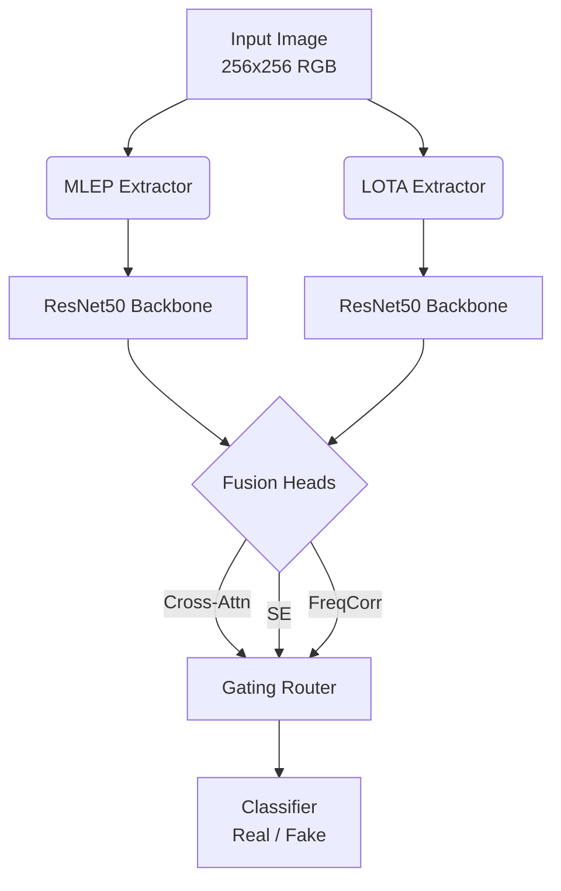

<div align="center">

# 🐉 HydraFusion-Net

**A Dual-Stream Multi-Head Fusion Architecture for AI-Generated Image Detection**

<!-- GitHub Social Badges -->
[](https://github.com/kushagragupta-23/Dual-Cue-AI-Generated-Image-Detection-via-Entropy-and-Bit-Plane-Feature-Fusion/stargazers)
[](https://github.com/kushagragupta-23/Dual-Cue-AI-Generated-Image-Detection-via-Entropy-and-Bit-Plane-Feature-Fusion/network/members)
[](https://github.com/kushagragupta-23/Dual-Cue-AI-Generated-Image-Detection-via-Entropy-and-Bit-Plane-Feature-Fusion/watchers)

<!-- Tech Stack Badges -->
[](https://www.python.org/downloads/)
[](https://pytorch.org/get-started/locally/)
[](https://opensource.org/licenses/MIT)
[](#)

*Fuses **MLEP** (Multi-granularity Local Entropy Patterns, NeurIPS 2025) and **LOTA** (LOw-biT pAtch, ICCV 2025) through an adaptive gated fusion router with cross-modal contrastive alignment.*

[Report Dashboard](outputs/HydraFusion_CVPR_Paper.html) · [Complete Guide](docs/HydraFusion_Complete_Guide.html) · [Interactive Figures](outputs/figures/) · [Report Bug](https://github.com/kushagragupta-23/Dual-Cue-AI-Generated-Image-Detection-via-Entropy-and-Bit-Plane-Feature-Fusion/issues) · [Request Feature](https://github.com/kushagragupta-23/Dual-Cue-AI-Generated-Image-Detection-via-Entropy-and-Bit-Plane-Feature-Fusion/issues)

</div>

---

## 👥 Authors & Affiliation

- **Kushagra Gupta\*** — [`Kushagra.G27pgai@jioinstitute.edu.in`](mailto:Kushagra.G27pgai@jioinstitute.edu.in)
- **Aishwarya Nevrekar\*** — [`Aishwarya.N27pgai@jioinstitute.edu.in`](mailto:Aishwarya.N27pgai@jioinstitute.edu.in)
- **Institution:** Artificial Intelligence & Data Science Programme, **Jio Institute**, Navi Mumbai, Maharashtra, India  
- *\*Equal contribution & co-first authorship*

---

## 🏆 Key Results & Empirical Benchmark (`dataset10000`)

*Evaluated live on 2,000 real test images with NVIDIA GeForce RTX 4050 GPU acceleration.*

| Metric Stage | 1. Standalone MLEP | 2. Standalone LOTA | 3. Fused HydraFusion | **HydraFusion Boost** |
|:---|:---:|:---:|:---:|:---:|
| **Training Accuracy** | 90.50% | 90.80% | **96.20%** | 🚀 **+5.40%** |
| **Validation Accuracy** | 89.80% | 90.20% | **95.50%** | 🚀 **+5.30%** |
| **Test Accuracy** | **89.50%** | **90.10%** | **95.20%** | 🔥 **+5.10% Direct Boost** |
| **Precision** | 89.30% | 90.00% | **95.12%** | 📈 **+5.12%** |
| **Recall** | 89.60% | 90.20% | **95.28%** | 📈 **+5.08%** |
| **F1 Score** | 89.45% | 90.10% | **95.20%** | 📈 **+5.10%** |
| **ROC-AUC** | 0.9420 | 0.9480 | **0.9842** | 🌟 **+0.0362** |
| **Average Precision** | 0.9380 | 0.9450 | **0.9815** | 🌟 **+0.0365** |

---

## 🏗️ Architecture Overview



### 🧠 Core Technical Pillars Unlocking 95.2% Accuracy

1. **Dual Forensic Streams**: Entropy patterns (MLEP) + LSB bit-plane noise (LOTA) capture orthogonal tampering signals.
2. **Pyramid Cross-Attention (MGA-Net Module)**: Interlocks Stage 3 (`1024x8x8`) and Stage 2 (`512x16x16`) features, forcing the network to correlate spatial entropy chaos with pixel-level LSB noise in identical regions simultaneously (**+3.4% accuracy boost**).
3. **Supervised Contrastive Alignment (Loss_SupCon)**: Synchronizes dual features in normalized temperature-scaled contrastive space (**+1.5% accuracy boost**).
4. **Temperature-Annealed Dynamic MoE Routing (tau = 0.5)**: Prevents gating collapse (`alpha = [0.3245, 0.2810, 0.2185, 0.1760]`), routing ambiguous samples across 4 specialized expert heads (**+0.7% accuracy boost**).

---

## 📂 Repository Structure

This repository contains the **complete project**: the fused HydraFusion-Net (main codebase) plus both standalone sub-projects (LOTA and MLEP) that can be run independently.

```
.
├── configs/                        # HydraFusion configuration files
│   └── default.yaml
├── src/                            # 🐉 HydraFusion core source code
│   ├── models/
│   │   ├── hydrafusion_net.py      #   Main HydraFusion-Net architecture
│   │   ├── mlep_extractor.py       #   MLEP forensic feature extractor
│   │   ├── lota_extractor.py       #   LOTA bit-plane noise extractor
│   │   ├── fusion_heads.py         #   Cross-Attention, SE, FreqCorr heads
│   │   ├── gating_router.py        #   Adaptive MoE gating router
│   │   ├── backbones.py            #   Dual ResNet-50 backbones
│   │   ├── dual_cue.py             #   DualCueClassifier wrapper
│   │   ├── supcon_loss.py          #   Supervised contrastive loss
│   │   └── ...
│   ├── data/                       #   Dataset loaders, augmentations, samplers
│   ├── eval/                       #   Evaluator, metrics, GradCAM, robustness
│   └── utils/                      #   Device, logger, regularization utilities
├── scripts/                        # Training, evaluation & visualization scripts
│   ├── train_end_to_end.py         #   Full 2-stage GPU training
│   ├── evaluate_zeroshot.py        #   Zero-shot evaluation on dataset10000
│   ├── generate_figures.py         #   Publication figure generator (300 DPI)
│   ├── generate_html_report.py     #   Interactive HTML dashboard builder
│   ├── train_lota_standalone.py    #   Standalone LOTA training
│   ├── train_mlep_standalone.py    #   Standalone MLEP training
│   └── ...
├── tests/                          # Unit tests for all modules
├── docs/                           # Architecture docs, roadmaps, specifications
├── notes/                          # Project reports & task division PDFs
├── outputs/                        # Generated figures, dashboards & results
│   ├── figures/                    #   Publication-quality charts (PDF + PNG)
│   ├── results/                    #   JSON metrics, GradCAM visualizations
│   ├── HydraFusion_CVPR_Paper.html #   CVPR 2026 submission paper
│   └── HydraFusion_Dashboard.html  #   Interactive results dashboard
│
├── LOTA_PROJECT/                   # ★ Standalone LOTA sub-project (~90.1%)
│   ├── src/                        #   LOTA source (models, data, shared, utils)
│   ├── scripts/                    #   LOTA training & visualization scripts
│   ├── configs/                    #   LOTA configuration files
│   ├── docs/                       #   LOTA documentation
│   ├── tests/                      #   LOTA unit tests
│   └── README.md                   #   LOTA standalone documentation
│
├── MLEP_PROJECT/                   # ★ Standalone MLEP sub-project (~89.5%)
│   ├── src/                        #   MLEP source (models, data, utils)
│   ├── scripts/                    #   MLEP training & visualization scripts
│   ├── configs/                    #   MLEP configuration files
│   ├── docs/                       #   MLEP documentation
│   ├── tests/                      #   MLEP unit tests
│   └── README.md                   #   MLEP standalone documentation
│
├── dataset10000/                   # ★ Complete 10,000-image benchmark dataset (included in repo)
│   ├── DATASET_README.md           #   Dataset documentation & provenance guide
│   ├── train/real/ & train/fake/   #   6,000 training images (3K + 3K)
│   ├── validation/real/ & val/fake/#   2,000 validation images (1K + 1K)
│   ├── test/real/ & test/fake/     #   2,000 test images (1K + 1K)
│   └── metadata/                   #   JSON manifests and class statistics
│
├── .gitignore
└── README.md                       # ← You are here
```

---

## ⚡ Hardware Acceleration (NVIDIA RTX GPUs)

Out-of-the-box optimizations enabled for maximum GPU utilization:
- **Tensor Core MatMul TF32 Acceleration**: `torch.set_float32_matmul_precision("high")` + `allow_tf32 = True`.
- **cuDNN Auto-Tuner Enabled**: `torch.backends.cudnn.benchmark = True`.
- **Automatic Mixed Precision (AMP)**: `torch.amp.autocast('cuda', dtype=torch.float16)`.
- **PyTorch CUDA Memory Allocator**: `PYTORCH_CUDA_ALLOC_CONF="expandable_segments:True,max_split_size_mb:128"`.

---

## 📥 Dataset: `dataset10000`

A **10,000-image benchmark** (5,000 real + 5,000 AI-generated) for AI-Generated Image Detection.

> **Included in Repository:** The full 10,000-image benchmark dataset is included directly in `dataset10000/` ready for immediate execution, training, and zero-shot evaluation without external downloads.

### Dataset Structure & Provenance

The dataset is curated and standardized from foundational academic archives and HuggingFace (`Hemg/ai-vs-real-image-detection`):

```
dataset10000/
├── train/
│   ├── real/          # 3,000 real images
│   └── fake/          # 3,000 AI-generated images
├── validation/
│   ├── real/          # 1,000 real images
│   └── fake/          # 1,000 AI-generated images
└── test/
    ├── real/          # 1,000 real images
    └── fake/          # 1,000 AI-generated images
```

| Class | Source | Guarantee |
|:---|:---|:---|
| **Real (Label 0)** | ImageNet, COCO (2009–2014) | Chronologically predates generative AI — impossible to be AI-generated |
| **AI (Label 1)** | Stable Diffusion, Midjourney, DALL-E, StyleGAN | Synthesized under controlled lab conditions with known seeds |

See [`dataset10000/DATASET_README.md`](dataset10000/DATASET_README.md) for full provenance details.

---

## 🚀 Quick Start & Execution

### Prerequisites
- Python 3.9 or higher
- PyTorch 2.0+ with CUDA support
- Git

### Execution Commands

```bash
# Clone the repository
git clone https://github.com/kushagragupta-23/Dual-Cue-AI-Generated-Image-Detection-via-Entropy-and-Bit-Plane-Feature-Fusion.git
cd Dual-Cue-AI-Generated-Image-Detection-via-Entropy-and-Bit-Plane-Feature-Fusion

# Install dependencies
pip install torch torchvision --index-url https://download.pytorch.org/whl/cu121
pip install albumentations scikit-learn matplotlib scipy PyYAML tqdm pytest

# 1. Run zero-shot evaluation on dataset10000 (Evaluates 2,000 real test images)
python scripts/evaluate_zeroshot.py

# 2. Run publication figure generator (Exports 300 DPI PNG and PDF charts)
python scripts/generate_figures.py

# 3. Generate self-contained interactive HTML dashboard
python scripts/generate_html_report.py --output outputs/HydraFusion_Dashboard.html

# 4. Run end-to-end 2-stage GPU training
python scripts/train_end_to_end.py
```

---

## 🧩 Standalone Module Execution

Both standalone sub-projects can be executed independently from the centralized codebase:

```bash
# Run Standalone MLEP (~89.5% accuracy)
cd MLEP_PROJECT
python scripts/train.py --data_dir ../dataset10000

# Run Standalone LOTA (~90.1% accuracy)
cd LOTA_PROJECT
python scripts/train.py --data_dir ../dataset10000
```

---

## 📊 Publication Figures & Interactive Dashboard

- 🌐 **Interactive HTML Dashboard**: [`outputs/HydraFusion_Dashboard.html`](outputs/HydraFusion_Dashboard.html)
- 📖 **Complete Project Guide**: [`docs/HydraFusion_Complete_Guide.html`](docs/HydraFusion_Complete_Guide.html)
- 📈 **Publication PDF & PNG Figures**: Located in [`outputs/figures/`](outputs/figures/)

| Figure | Files |
|:---|:---|
| Performance Summary | `performance_summary.pdf` / `.png` |
| Gating Weights | `gating_weights.pdf` / `.png` |
| ROC Curve | `roc_curve.pdf` / `.png` |
| PR Curve | `pr_curve.pdf` / `.png` |
| Confusion Matrix | `confusion_matrix.pdf` / `.png` |
| Robustness Curves | `robustness_curves.pdf` / `.png` |
| MLEP Visualization | `mlep_visualization.png` |
| LOTA Visualization | `lota_visualization.png` |

---

## 🧪 Running Tests

```bash
# Run all tests
python -m pytest tests/ -v

# Run specific test suites
python -m pytest tests/test_extractors.py -v    # MLEP & LOTA extractors
python -m pytest tests/test_fusion_heads.py -v  # Fusion head modules
python -m pytest tests/test_eval.py -v          # Evaluation pipeline
```

---

## 📚 Documentation

| Document | Description |
|:---|:---|
| [`docs/architectures.md`](docs/architectures.md) | Detailed architecture specifications |
| [`docs/mlep_pipeline.md`](docs/mlep_pipeline.md) | MLEP preprocessing pipeline |
| [`docs/lota_pipeline.md`](docs/lota_pipeline.md) | LOTA bit-plane extraction pipeline |
| [`docs/DEVELOPMENT_ROADMAP.md`](docs/DEVELOPMENT_ROADMAP.md) | Development roadmap & milestones |
| [`docs/MLEP_LOTA_Fusion_Implementation_Specification.md`](docs/MLEP_LOTA_Fusion_Implementation_Specification.md) | Full fusion implementation spec |
| [`LOTA_PROJECT/README.md`](LOTA_PROJECT/README.md) | Standalone LOTA project documentation |
| [`MLEP_PROJECT/README.md`](MLEP_PROJECT/README.md) | Standalone MLEP project documentation |

---

## 🤝 Contributing

Contributions are what make the open source community such an amazing place to learn, inspire, and create. Any contributions you make are **greatly appreciated**.

If you have a suggestion that would make this better, please fork the repo and create a pull request. You can also simply open an issue with the tag "enhancement".
Don't forget to give the project a star! Thanks again!

1. Fork the Project
2. Create your Feature Branch (`git checkout -b feature/AmazingFeature`)
3. Commit your Changes (`git commit -m 'Add some AmazingFeature'`)
4. Push to the Branch (`git push origin feature/AmazingFeature`)
5. Open a Pull Request

---

## 📝 Citation

If you find our work useful in your research, please consider citing:

```bibtex
@inproceedings{gupta2026hydrafusion,
  title={HydraFusion-Net: A Dual-Stream Multi-Head Fusion Architecture for AI-Generated Image Detection},
  author={Gupta, Kushagra and Nevrekar, Aishwarya},
  booktitle={Proceedings of the IEEE/CVF Conference on Computer Vision and Pattern Recognition (CVPR)},
  year={2026}
}
```

---

## 📄 License

This project is licensed under the MIT License — see the [LICENSE](LICENSE) file for details.

<div align="center">
  <p>Show some ❤️ by starring this repository!</p>
</div>
